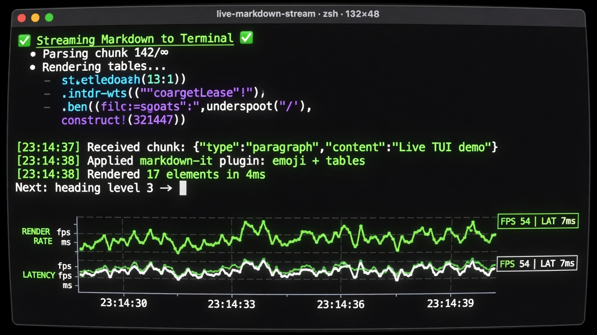

# live-stream-tui



Live **markdown stream** TUI + Hermes-style **render-rate graph**, as a
**Grok Build harness add-on**.

The real binary is Rust. It sits inside a local [xai-org/grok-build](https://github.com/xai-org/grok-build)
checkout and uses the same `StreamingMarkdownRenderer` the pager uses for
incremental markdown (checkpoint freeze, O(tail) re-render).

Upstream grok-build does **not** accept external PRs. This repo is the public
surface + docs + prototype archive. Implementation lives as a local crate in
your harness tree:

```
grok-build/crates/codegen/xai-live-stream-tui/
```

## Why not the Python prototype?

`ref/python/` is the old Textual demo. Headless smokes passed; the live TUI
could crash on stream end, and it never used Grok Build's real markdown path.
Rust + `xai-grok-markdown` is the product.

## In Grok (primary)

The graph is **embedded in the Grok pager chat** as an intentional data
stream. It auto-shows when the agent calls **`stream_graph`** (or other
code feeds plot points). Markdown text streaming does **not** open it.
Optional pin:

```
/graph              pin plot band (stays) or dismiss (suppress until quiet)
/graph mode         plot <-> demo <-> live
/graph fill         pink fill on/off
/debug graph        same as /graph
```

See [GROK-INTEGRATION.md](GROK-INTEGRATION.md).

## Standalone binary (requires local grok-build)

```bat
cd /d C:\Code\grok-build
cargo build -p xai-live-stream-tui --release
target\release\live-stream.exe graph --dump
```

## Use

```powershell
# Hermes dual-line FPS graph (replay curve)


cargo run -p xai-live-stream-tui -- graph

# Measure full re-parse vs StreamingMarkdownRenderer


cargo run -p xai-live-stream-tui -- graph --mode bench --blocks 128

# Synthetic stream


cargo run -p xai-live-stream-tui -- demo
cargo run -p xai-live-stream-tui -- flood --chars 20000

# Real Grok headless stream into the TUI


cargo run -p xai-live-stream-tui -- grok "Explain RoPE in 3 bullets" --yolo

# Pipe any streaming-json producer


grok -p "hello" --output-format streaming-json | cargo run -p xai-live-stream-tui -- pipe
```

Keys (stream): `q` quit · `a` autoscroll · `p` pause · arrows scroll  
Keys (graph): `q` quit · `r` restart · `m` toggle replay/bench · `f` fill

## Event format (pipe / grok)

Same as Grok Build headless emitter (`xai-grok-pager` headless):

```json
{"type":"text","data":"Hello"}
{"type":"thought","data":"..."}
{"type":"end","stopReason":"EndTurn"}
{"type":"error","message":"..."}
```

Other types (`available_commands`, `usage`, …) are ignored.

## Architecture

```
grok --output-format streaming-json
        │  NDJSON text/thought/end
        â–¼
  live-stream (this crate)
        │  coalesce at --fps
        â–¼
  xai_grok_markdown::StreamingMarkdownRenderer
        │  freeze settled blocks, re-render tail
        â–¼
  ratatui (stream view + Hermes graph)
```

Graph series:

| series | meaning |
|--------|---------|
| cyan **after** | streaming renderer (O(tail)) |
| pink **before** | full `render_markdown_ratatui_full` each update (O(n)) |

## Layout

| path | role |
|------|------|
| `../grok-build/crates/codegen/xai-live-stream-tui/` | Rust implementation |
| `ref/` | Hermes tweet frames / video |
| `ref/python/` | retired Textual prototype |

## License

MIT for this packaging repo. The harness crate is Apache-2.0 like Grok Build
(local add-on; not an upstream contribution).
